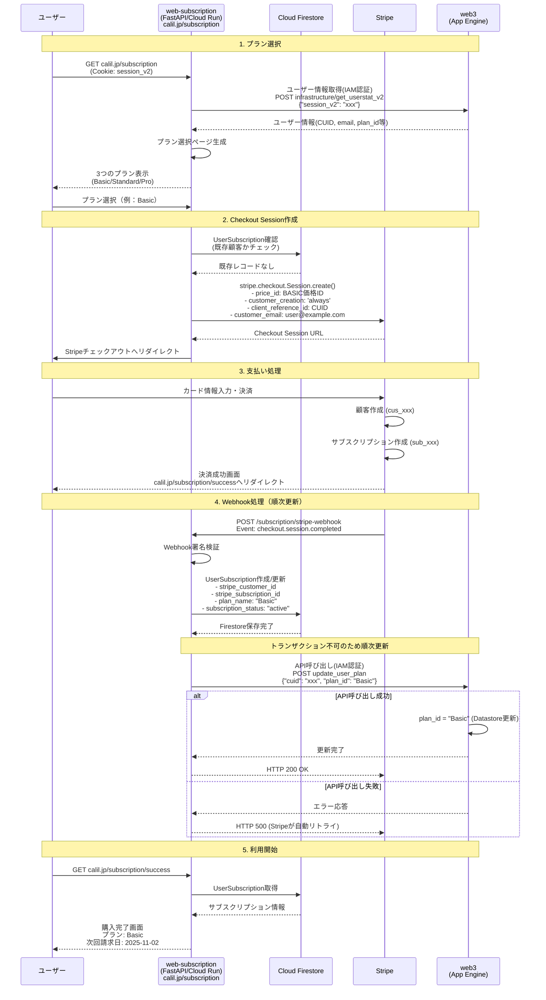

# web-subscription

このファイルは Claude Code (claude.ai/code) がこのリポジトリで作業する際のガイドです。

## 概要
月額課金のカーリル プレミアムプランをStripe Checkoutで実装  
カーリルのMCPサーバーは基本無料で使えるが、このプランを購入すると利用上限が上がる

## 要件
- **プラン**: 月額1,000円、2000円、5000円の3プラン
- **課金対象**: MCPサーバーの利用上限が上がる
- **Stripe実装**: Stripe Checkout + Customer Portal使用
- **無料トライアル**: なし
- **解約ポリシー**: 期間終了まで利用可能
- **支払い失敗**: Stripeの自動リトライ機能を利用
- **請求書・領収書**: Stripeのデフォルト機能を利用
- **請求サイクル**:
  - 開始日: 購入日（即座に利用開始可能）
  - 終了日: 翌月の同日（Stripeが月末を自動調整）
  - 例: 10月15日購入 → 11月15日が次回請求日
  - 月末調整例: 1月31日購入 → 2月28日（または29日）に請求

## プラン変更ポリシー
- **アップグレード**: 即座に反映、差額を日割り請求
  - `proration_behavior: 'always_invoice'` を使用
  - 例: 月の途中でBasic→Standardの場合、残り日数分の差額（1,000円の日割り）を請求
- **ダウングレード**: 次回請求サイクルから反映
  - `proration_behavior: 'none'` を使用
  - 現在の請求期間終了まで現行プランを利用可能
- **Customer Portal設定**:
  - Stripeダッシュボードで上記ポリシーに合わせて設定


## 技術スタック

- **言語**: Python 3.13+
- **フレームワーク**: FastAPI, Pydantic V2
- **データベース**: Google Cloud Firestore (ネイティブモード)
- **パッケージ管理**: uv 0.6.10+
- **テスト**: pytest, mypy (型安全性100%達成)

## プロジェクト構造

```
web-subscription/
├── app/
│   ├── main.py                 # FastAPIアプリケーション
│   ├── config/
│   │   └── settings.py         # 環境変数、Stripe設定
│   ├── core/
│   │   ├── stripe_service.py   # Stripe操作
│   │   └── subscription.py     # サブスクリプション管理
│   ├── infrastructure/
│   │   ├── firestore.py        # Firestore接続
│   │   └── web3_api.py         # web3 API連携
│   ├── models/
│   │   └── subscription.py     # UserSubscriptionモデル
│   └── templates/
│       ├── pricing.html        # プラン選択画面
│       └── success.html        # 購入完了画面
├── scripts/
│   └── sync_checker.py         # 日次同期チェックバッチ
├── tests/
│   ├── conftest.py
│   └── test_*.py
├── .env                        # 環境変数（開発環境）
├── pyproject.toml              # プロジェクト設定
└── .github/workflows/          # CI/CD設定
```


## 開発コマンド

```bash
# 依存関係のインストール
uv sync

# 開発サーバー起動
uv run uvicorn app.main:app --reload --port 5000

# テスト実行
USE_MOCK_FIRESTORE=true uv run python -m pytest tests/ -v

# 型チェック
uv run mypy app --ignore-missing-imports

# セキュリティチェック
uv run bandit -r app -ll -x "**/firestore_mock.py"

# テストカバレッジ
uv run python -m pytest tests/ --cov=app --cov-report=term-missing
```

## 環境変数

```bash
# 必須設定（本番環境）
APP_ENV=production                        # 本番環境指定（APIドキュメント自動無効化）
GOOGLE_CLOUD_PROJECT=your-project-id      # Firestore プロジェクトID
WEB3_AUDIENCE=https://libmuteki2.appspot.com  # web3 IAM認証のAudience

# 開発環境
USE_MOCK_FIRESTORE=true                   # Firestoreモック使用
APP_ENV=development                       # 開発環境（APIドキュメント有効）

# Stripe設定
STRIPE_SECRET_KEY=sk_xxx
STRIPE_WEBHOOK_SECRET=whsec_xxx
STRIPE_PRICE_ID_BASIC=price_xxx        # 月額1,000円プラン
STRIPE_PRICE_ID_STANDARD=price_xxx     # 月額2,000円プラン
STRIPE_PRICE_ID_PRO=price_xxx          # 月額5,000円プラン
STRIPE_PUBLISHABLE_KEY=pk_xxx
```

## データモデル設計

### UserSubscription (Cloud Firestore)

**管理方針**: 1ユーザーにつき1ドキュメント（再購入時は既存ドキュメントを更新）
**実装場所**: `app/models/subscription.py`
**注意**: web3（Datastore）とはトランザクション不可のため、順次更新で整合性を保証

**ドキュメントID**: カーリルのCUID（ユーザー識別子）を直接使用
例: ドキュメントパス `users_subscriptions/{cuid}`
- CUIDはフィールドとしては保存せず、ドキュメントIDから取得
- これにより1ユーザー1ドキュメントを保証

**フィールド構成**:
```python
{
    # Stripe情報
    'stripe_customer_id': str,        # cus_xxx
    'stripe_subscription_id': str,    # sub_xxx
    'stripe_price_id': str,           # price_xxx

    # サブスクリプション情報
    'plan_name': str,                 # Basic/Standard/Pro
    'plan_amount': int,               # 1000/2000/5000
    'subscription_status': str,       # active/canceled/past_due等
                                      # ステータスの詳細: https://docs.stripe.com/billing/subscriptions/overview?locale=ja-JP

    'current_period_end': datetime,   # 現在の請求期間終了日

    # メタ情報
    'created': datetime,              # 作成日時
    'updated': datetime               # 更新日時
}
```

**主要メソッド**:
- `create_or_update(cuid, data)` - ドキュメント作成/更新（cuidをドキュメントIDに使用）
- `get_by_cuid(cuid)` - ドキュメントID（CUID）で直接取得
- `get_by_stripe_customer_id(customer_id)` - Stripe顧客IDで検索

## エンドポイント

`app/main.py`に実装するエンドポイント：
- `GET /subscription` - プラン選択画面
- `POST /subscription/create-checkout-session` - Checkout Session作成
- `POST /subscription/stripe-webhook` - Webhook受信
- `POST /subscription/create-portal-session` - Customer Portal URL生成
- `GET /subscription/success` - 購入完了画面

## ユーザー認証とセッション管理

### カーリルのユーザー情報取得 (IAM認証版)

**エンドポイント**: `POST https://calil.jp/infrastructure/get_userstat_v2`
- **認証**: Google IAM認証（Cloud Runのサービスアカウントからアクセス）
- **セッションキー**: リクエストボディの`session_v2`フィールドで送信

**リクエスト**:
```json
{
  "session_v2": "JWTセッショントークン（Cookieから取得）"
}
```

**レスポンス例**:
```json
{
  "stat": "ok",
  "userkey": "calil:319f56829582135bca42cf125fbc8192",
  "cuid": "4754259718",
  "email": "deguchik@gmail.com",
  "nickname": "出口",
  "fill_profile": 1,
  "profile": "京都銀閣寺界隈を徘徊するプログラマーです。",
  "thumbnail_url": "/profile/pics/1001.jpg",
  "newsletter": 1,
  "service": "google",
  "plan_id": "Basic",
  "date": "2013-01-07 02:24:34.686283",
  "update": "2013-11-14 01:16:46.162134",
  "requested_by": "service-account@project.iam.gserviceaccount.com"
}
```

**重要フィールド**:
- `cuid`: ユーザー識別子（Firestore文書IDとして使用）
- `email`: Stripe顧客作成時に使用
- `nickname`: ユーザー表示名
- `plan_id`: 現在のプラン（'Basic'/'Standard'/'Pro'、未契約は空文字）

## web3側で必要な実装

### UserStatモデルへの追加（web3リポジトリ側）

既存の[web3](https://github.com/CALIL/web3)（Cloud Datastore使用）のUserStatモデルに以下のプロパティを追加
- `plan_id`: StringProperty(default='') - プラン名を格納（'Basic'/'Standard'/'Pro'、未契約は空文字）

### API仕様

#### ユーザー情報取得API: infrastructure/get_userstat_v2

**エンドポイント**: `POST https://calil.jp/infrastructure/get_userstat_v2`
**認証**: Google IAM認証

**リクエストボディ**:

```json
{
  "session_v2": "JWTセッショントークン"
}
```

**レスポンス**（plan_idフィールドを含む）:

```json
{
  "stat": "ok",
  "cuid": "4754259718",
  "plan_id": "Basic",
  "requested_by": "service-account@project.iam.gserviceaccount.com"
  // ...その他のユーザー情報フィールド
}
```

#### プラン更新API: infrastructure/update_user_plan

**エンドポイント**: `POST https://calil.jp/infrastructure/update_user_plan`
**認証**: Google IAM認証

**リクエストボディ**:

```json
{
  "cuid": "4754259718",
  "plan_id": "Basic"  // 'Basic'/'Standard'/'Pro' または空文字
}
```

**レスポンス**:

```json
{
  "success": true,
  "cuid": "4754259718",
  "plan_id": "Basic",
  "updated_by": "service-account@project.iam.gserviceaccount.com"
}
```

**エラーレスポンス**:
- 401: IAM認証失敗
- 404: 指定されたCUIDのユーザーが存在しない
- 400: リクエストボディが不正またはplan_idが無効
- 500: データベース更新エラー

### IAM認証実装例

**Pythonでのweb3 API呼び出し例**:

```python
import httpx
from google.auth.transport.requests import Request
from google.oauth2 import id_token
import google.auth

class Web3APIClient:
    """web3 API (IAM認証) クライアント"""

    def __init__(self, audience: str = "https://libmuteki2.appspot.com"):
        self.audience = audience
        self.base_url = "https://calil.jp/infrastructure"

    def _get_id_token(self) -> str:
        """Google IAM IDトークンの取得"""
        credentials, project = google.auth.default()
        auth_req = Request()
        return id_token.fetch_id_token(auth_req, self.audience)

    async def get_user_info(self, session_v2: str) -> dict:
        """ユーザー情報取得 (get_userstat_v2)"""
        async with httpx.AsyncClient() as client:
            response = await client.post(
                f"{self.base_url}/get_userstat_v2",
                headers={
                    'Authorization': f'Bearer {self._get_id_token()}',
                    'Content-Type': 'application/json'
                },
                json={'session_v2': session_v2}
            )
            response.raise_for_status()
            return response.json()

    async def update_user_plan(self, cuid: str, plan_id: str) -> dict:
        """ユーザープラン更新"""
        async with httpx.AsyncClient() as client:
            response = await client.post(
                f"{self.base_url}/update_user_plan",
                headers={
                    'Authorization': f'Bearer {self._get_id_token()}',
                    'Content-Type': 'application/json'
                },
                json={'cuid': cuid, 'plan_id': plan_id}
            )
            response.raise_for_status()
            return response.json()
```

## Stripe顧客管理

### 顧客IDの管理方針

- **stripe_customer_id**: Stripeが生成する顧客ID（`cus_`で始まる文字列）
- **client_reference_id**: カーリルのCUIDを設定（Stripeとカーリルの紐付け）

### 顧客作成フロー

1. **初回購入時**:
   - `customer_creation='always'`で自動的にStripe顧客を作成
   - `customer_email`にカーリルのユーザーメールを設定
      - 空白にした場合、[Stripe側でユーザーにメールアドレスを尋ねる](https://docs.stripe.com/api/checkout/sessions/object?api-version=2025-09-30.preview)
      - カーリルのemailが未検証の場合、どうするかは最後に調整
   - `client_reference_id`にCUIDを設定

2. **再購入時**:
   - 保存済みの`stripe_customer_id`を`customer`パラメータに設定
   - 既存の顧客情報を再利用

## 初回購入フローの詳細



### フロー補足説明

1. **プラン選択**: calil.jp/subscriptionでプラン選択ページを表示（reverse-proxy経由）
2. **Checkout Session作成**: FastAPI APIがStripeのCheckout Sessionを作成し、顧客情報を紐付け
3. **支払い処理**: ユーザーがStripeのチェックアウト画面でカード情報を入力
4. **Webhook処理**: 決済成功後、StripeからWebhookを受信してデータベース更新、web3のUserStatも更新
5. **利用開始**: 購入完了画面でサブスクリプション状態を確認

## Stripe Webhook処理

### 処理するイベント

- `checkout.session.completed`: 初回決済完了（顧客IDを保存）
- `customer.subscription.updated`: サブスクリプション更新
- `customer.subscription.deleted`: サブスクリプション削除
- `invoice.payment_succeeded`: 更新決済成功
- `invoice.payment_failed`: 支払い失敗


## 実装手順

1. **基盤構築**
   - `uv init` → `uv add fastapi[standard] google-cloud-firestore stripe python-dotenv`
   - `.env`ファイル作成（環境変数設定）
   - Firestore有効化

2. **コア実装**
   - `app/models/subscription.py` - UserSubscriptionモデル
   - `app/core/stripe_service.py` - Stripe操作ロジック
   - `app/infrastructure/firestore.py` - DB接続
   - `app/main.py` - FastAPIエンドポイント

3. **Webhook処理**
   - 署名検証とイベント処理ハンドラー
   - web3 API連携（`app/infrastructure/web3_api.py`）

4. **監視バッチ実装**
   - `scripts/sync_checker.py` - 日次同期チェック
   - Cloud Schedulerでの定期実行設定

5. **テスト**
   - `stripe listen --forward-to localhost:5000/subscription/stripe-webhook`
   - テストカードで決済フロー確認

6. **デプロイ**
   - Cloud Run設定・環境変数設定
   - Webhook URL登録
   - Cloud Schedulerジョブ作成

## セキュリティ考慮事項

- Webhook署名の必須検証
- CSRF保護の実装
- ユーザー認証必須
- APIキーの環境変数管理
- HTTPSでの通信必須

## 品質指標

✅ テスト: 0個全パス（DCR含む、警告0）
✅ 型安全性: mypy エラー0
✅ カバレッジ: 主要機能0%以上
✅ CI/CD: GitHub Actions自動テスト

## エラーハンドリングとリカバリー

### Webhook処理

- **成功時**: HTTPステータス200を返す
- **失敗時**: 500エラーを返してStripeの自動リトライ（最大72時間）を利用
- **エラー監視**: Sentryで例外を捕捉・通知
- **冪等性の確保**: イベントIDで重複処理を防ぐ

### 決済失敗時の対応

- **自動リトライ**: Stripeのデフォルト設定（3回まで自動リトライ）
- **ユーザー通知**: Stripeから自動メール送信（日本語対応）
- **管理者通知**: 重要なエラーはSentryで通知

### データ整合性

- **重要な制約**: web3（Cloud Datastore）とweb-subscription（Cloud Firestore）は異なるデータベースのため、トランザクションによる同時更新は不可
- **整合性保証の方針**:
  1. **順次更新**: Webhook受信時に以下の順序で更新
     - 先にFirestoreのUserSubscriptionを更新
     - 成功したらweb3 APIを呼び出してUserStatを更新
     - UserStat更新が失敗した場合は、Stripeに500エラーを返してリトライを促す
  2. **冪等性の確保**:
     - UserSubscriptionの`updated`フィールドとStripeイベントのタイムスタンプを比較
     - 同じイベントIDの重複処理を防ぐ
  3. **リトライメカニズム**:
     - Stripeの自動リトライ（最大72時間）を活用
     - web3 API呼び出し失敗時は内部で3回までリトライ
  4. **監視とアラート**:
     - 不整合検出時はSentryで通知
     - 日次バッチで両システムの同期状態を確認（`scripts/sync_checker.py`）
     - 不整合があれば手動修正またはバッチ修正


## 注意事項

- 本番環境では `APP_ENV=production` を必ず設定（APIドキュメント無効化）
- Windows環境では `127.0.0.1` を使用（`0.0.0.0` は避ける）
- Firestoreモックファイル（`firestore_mock.py`）はセキュリティチェックから除外

## 関連ドキュメント

- [Stripe API](https://docs.stripe.com/api)