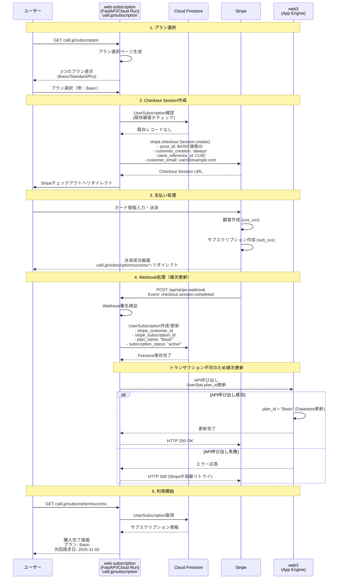

# web-subscription

このファイルは Claude Code (claude.ai/code) がこのリポジトリで作業する際のガイドです。

## 概要
月額課金のカーリル プレミアムプランをStripe Checkoutで実装  
カーリルのMCPサーバーは基本無料で使えるが、このプランを購入すると利用上限が上がる

## 要件
- **プラン**: 月額1,000円、2000円、5000円の3プラン
- **課金対象**: MCPサーバーの利用上限が上がる
- **Stripe実装**: Stripe Checkout + Customer Portal使用
- **無料トライアル**: なし
- **解約ポリシー**: 期間終了まで利用可能
- **支払い失敗**: Stripeの自動リトライ機能を利用
- **請求書・領収書**: Stripeのデフォルト機能を利用
- **請求サイクル**:
  - 開始日: 購入日（即座に利用開始可能）
  - 終了日: 翌月の同日（Stripeが月末を自動調整）
  - 例: 10月15日購入 → 11月15日が次回請求日
  - 月末調整例: 1月31日購入 → 2月28日（または29日）に請求

## プラン変更ポリシー
- **アップグレード**: 即座に反映、差額を日割り請求
  - `proration_behavior: 'always_invoice'` を使用
  - 例: 月の途中でBasic→Standardの場合、残り日数分の差額（1,000円の日割り）を請求
- **ダウングレード**: 次回請求サイクルから反映
  - `proration_behavior: 'none'` を使用
  - 現在の請求期間終了まで現行プランを利用可能
- **Customer Portal設定**:
  - Stripeダッシュボードで上記ポリシーに合わせて設定


## 技術スタック

- **言語**: Python 3.13+
- **フレームワーク**: FastAPI, Pydantic V2
- **データベース**: Google Cloud Firestore (ネイティブモード)
- **パッケージ管理**: uv 0.6.10+
- **テスト**: pytest, mypy (型安全性100%達成)


## 開発コマンド

```bash
# 依存関係のインストール
uv sync

# 開発サーバー起動
uv run uvicorn app.main:app --reload --port 5000

# テスト実行
USE_MOCK_FIRESTORE=true uv run python -m pytest tests/ -v

# 型チェック
uv run mypy app --ignore-missing-imports

# セキュリティチェック
uv run bandit -r app -ll -x "**/firestore_mock.py"

# テストカバレッジ
uv run python -m pytest tests/ --cov=app --cov-report=term-missing
```

## 環境変数

```bash
# 必須設定（本番環境）
APP_ENV=production                        # 本番環境指定（APIドキュメント自動無効化）
INFRASTRUCTURE_API_PASSWORD=xxx           # カーリルセッションAPI認証
GOOGLE_CLOUD_PROJECT=your-project-id      # Firestore プロジェクトID

# 開発環境
USE_MOCK_FIRESTORE=true                   # Firestoreモック使用
APP_ENV=development                       # 開発環境（APIドキュメント有効）
```

## データモデル設計

### UserStatモデルへの追加（web3リポジトリ側）

既存のweb3リポジトリ（**Cloud Datastore使用**）のUserStatモデルに以下のプロパティを追加:
- `plan_id`: StringProperty(default='') - プラン名を格納（'Basic'/'Standard'/'Pro'、未契約は空文字）

#### 新規モデル: UserSubscription (Cloud Firestore)

**管理方針**: 1ユーザーにつき1ドキュメント（再購入時は既存ドキュメントを更新）  
**実装場所**: web-subscriptionリポジトリ（Cloud Run上で動作）  
**データベース選択の理由**:
- web3とは独立したマイクロサービスとして構築
- Firestoreのリアルタイム同期機能を将来的に活用予定
- **注意**: web3（Datastore）とはトランザクション不可のため、順次更新で整合性を保証

```python
from google.cloud import firestore
from datetime import datetime

class UserSubscriptionModel:
    """Google Cloud Firestoreを使用したUserSubscriptionモデル"""

    COLLECTION = 'user_subscriptions'

    @classmethod
    def create_or_update(cls, db: firestore.Client, data: dict):
        """UserSubscriptionドキュメントの作成または更新"""
        # cuidをドキュメントIDとして使用
        doc_ref = db.collection(cls.COLLECTION).document(data['cuid'])

        # ドキュメントの存在確認
        doc = doc_ref.get()

        # ドキュメントのデータを設定
        doc_data = {
            # Stripe情報
            'stripe_customer_id': data.get('stripe_customer_id', ''),
            'stripe_subscription_id': data.get('stripe_subscription_id', ''),
            'stripe_price_id': data.get('stripe_price_id', ''),

            # サブスクリプション情報
            'plan_name': data.get('plan_name', ''),  # Basic/Standard/Pro
            'plan_amount': data.get('plan_amount', 0),  # 1000/2000/5000
            'subscription_status': data.get('subscription_status', ''),
            # ステータスの詳細: https://docs.stripe.com/billing/subscriptions/overview?locale=ja-JP
            # 主なステータス:
            # - active: 有効（支払い済み）
            # - past_due: 支払い期限超過（リトライ中）
            # - canceled: キャンセル済み
            # - incomplete: 初回支払い未完了
            # - incomplete_expired: 初回支払い期限切れ
            # - trialing: トライアル中
            # - unpaid: 未払い（リトライ終了）

            'subscription_start_date': data.get('subscription_start_date'),
            'subscription_end_date': data.get('subscription_end_date'),
            'current_period_end': data.get('current_period_end'),

            # メタ情報
            'updated': firestore.SERVER_TIMESTAMP  # レコード更新日
        }

        # 新規作成時のみcreatedを設定
        if not doc.exists:
            doc_data['created'] = firestore.SERVER_TIMESTAMP

        doc_ref.set(doc_data, merge=True)
        return doc_ref.get()

    @classmethod
    def get_by_cuid(cls, db: firestore.Client, cuid: str):
        """CUIDによるUserSubscriptionドキュメントの取得"""
        doc_ref = db.collection(cls.COLLECTION).document(cuid)
        doc = doc_ref.get()
        return doc.to_dict() if doc.exists else None

    @classmethod
    def get_by_stripe_customer_id(cls, db: firestore.Client, stripe_customer_id: str):
        """Stripe顧客IDによるUserSubscriptionドキュメントの取得"""
        docs = db.collection(cls.COLLECTION).where(
            'stripe_customer_id', '==', stripe_customer_id
        ).limit(1).stream()

        for doc in docs:
            return doc.to_dict()
        return None
```

## コントローラー実装

### app.py
- `SubscriptionPage`: サブスクリプション管理画面
- `PricingPage`: プラン選択画面（3つのプランを表示）
- `CreateCheckoutSession`: Checkout Session作成API（プランIDを受け取る）
- `StripeWebhook`: Webhook受信エンドポイント
- `CustomerPortalSession`: Customer Portal URLの生成

## Stripe顧客管理

### 顧客IDの管理方針

- **stripe_customer_id**: Stripeが生成する顧客ID（`cus_`で始まる文字列）
- **client_reference_id**: カーリルのCUIDを設定（Stripeとカーリルの紐付け）

### 顧客作成フロー

1. **初回購入時**:
   - `customer_creation='always'`で自動的にStripe顧客を作成
   - `customer_email`にカーリルのユーザーメールを設定
      - 空白にした場合、(Stripe側でユーザーにメールアドレスを尋ねる)[https://docs.stripe.com/api/checkout/sessions/object?api-version=2025-09-30.preview]
      - カーリルのemailが未検証の場合、どうするかは最後に調整
   - `client_reference_id`にCUIDを設定

2. **再購入時**:
   - 保存済みの`stripe_customer_id`を`customer`パラメータに設定
   - 既存の顧客情報を再利用

## 初回購入フローの詳細



### フロー補足説明

1. **プラン選択**: calil.jp/subscriptionでプラン選択ページを表示（reverse-proxy経由）
2. **Checkout Session作成**: FastAPI APIがStripeのCheckout Sessionを作成し、顧客情報を紐付け
3. **支払い処理**: ユーザーがStripeのチェックアウト画面でカード情報を入力
4. **Webhook処理**: 決済成功後、StripeからWebhookを受信してデータベース更新、web3のUserStatも更新
5. **利用開始**: 購入完了画面でサブスクリプション状態を確認

## Stripe Webhook処理

### 処理するイベント

- `checkout.session.completed`: 初回決済完了（顧客IDを保存）
- `customer.subscription.updated`: サブスクリプション更新
- `customer.subscription.deleted`: サブスクリプション削除
- `invoice.payment_succeeded`: 更新決済成功
- `invoice.payment_failed`: 支払い失敗

## web3側で必要なAPI実装

### 新規API: infrastructure/update_user_plan
**エンドポイント**: POST /api/infrastructure/update_user_plan
**認証**: INFRASTRUCTURE_API_PASSWORD必須
**リクエストボディ**:
```json
{
  "cuid": "user_cuid_here",
  "plan_id": "Basic"  // 'Basic'/'Standard'/'Pro' または空文字
}
```
**レスポンス**:
```json
{
  "success": true,
  "cuid": "user_cuid_here",
  "plan_id": "Basic"
}
```
**実装内容**:
- UserStatエンティティの`plan_id`フィールドを更新
- 存在しないユーザーの場合は404エラー
- 更新失敗時は500エラー

### 既存API: infrastructure/get_userstat
返却JSONに以下のフィールドを追加:

- `plan_id`: プラン名（'Basic'/'Standard'/'Pro'、未契約は空文字）

### 環境変数設定

### secret.yamlへの追加
```yaml
env_variables:
  STRIPE_SECRET_KEY: 'sk_xxx'
  STRIPE_WEBHOOK_SECRET: 'whsec_xxx'
  STRIPE_PRICE_ID_BASIC: 'price_xxx'     # 月額1,000円プラン
  STRIPE_PRICE_ID_STANDARD: 'price_xxx'  # 月額2,000円プラン
  STRIPE_PRICE_ID_PRO: 'price_xxx'       # 月額5,000円プラン
  STRIPE_PUBLISHABLE_KEY: 'pk_xxx'
```

## 実装手順

1. **Phase 1: 基盤構築**
   - プロジェクトセットアップ
     - `uv init`でPython 3.13プロジェクト初期化
     - `uv add fastapi[standard] google-cloud-firestore stripe`で依存関係追加
   - Google Cloud設定
     - サービスアカウント作成と認証設定
     - Firestore有効化
   - 環境変数設定
     - `.env`ファイル作成（開発環境）
     - Cloud Run環境変数設定（本番環境）

2. **Phase 2: データモデル実装**
   - `models/subscription.py`作成
     - UserSubscriptionModelクラス実装
     - Firestore接続ユーティリティ作成
   - web3リポジトリ側の対応
     - UserStatモデルに`plan_id`フィールド追加

3. **Phase 3: FastAPI APIエンドポイント実装**
   - `app.py`作成（FastAPIアプリケーション）
   - `/api/create-checkout-session` - Checkout Session作成
   - `/api/stripe-webhook` - Webhook受信
   - `/api/create-portal-session` - Customer Portal URL生成
   - `/api/subscription-status` - サブスクリプション状態取得

4. **Phase 4: Stripe Webhook処理実装**
   - Webhook署名検証
   - イベント処理ハンドラー実装
     - `checkout.session.completed`
     - `customer.subscription.updated`
     - `customer.subscription.deleted`
     - `invoice.payment_succeeded`
     - `invoice.payment_failed`

5. **Phase 5: web3リポジトリとの連携**
   - infrastructure APIの拡張
     - `get_userstat`にplan_id追加
   - MCPサーバー側の利用制限実装
     - plan_idに基づくレート制限

6. **Phase 6: ローカルテスト**
   - Stripe CLIインストール
   - `stripe listen --forward-to localhost:5000/api/stripe-webhook`
   - テストカードでの決済フロー確認

7. **Phase 7: Cloud Runデプロイ**
   - Dockerfile作成
   - Cloud Build設定
   - デプロイスクリプト作成
   - 環境変数設定

8. **Phase 8: 本番準備**
   - Stripe本番環境設定
   - Webhook URL登録（Cloud Run URL）
   - セキュリティチェック
   - モニタリング設定

## セキュリティ考慮事項

- Webhook署名の必須検証
- CSRF保護の実装
- ユーザー認証必須
- APIキーの環境変数管理
- HTTPSでの通信必須

## エラーハンドリングとリカバリー

### Webhook処理

- **成功時**: HTTPステータス200を返す
- **失敗時**: 500エラーを返してStripeの自動リトライ（最大72時間）を利用
- **エラー監視**: Sentryで例外を捕捉・通知
- **冪等性の確保**: イベントIDで重複処理を防ぐ

### 決済失敗時の対応

- **自動リトライ**: Stripeのデフォルト設定（3回まで自動リトライ）
- **ユーザー通知**: Stripeから自動メール送信（日本語対応）
- **管理者通知**: 重要なエラーはSentryで通知

### データ整合性

- **重要な制約**: web3（Cloud Datastore）とweb-subscription（Cloud Firestore）は異なるデータベースのため、トランザクションによる同時更新は不可
- **整合性保証の方針**:
  1. **順次更新**: Webhook受信時に以下の順序で更新
     - 先にFirestoreのUserSubscriptionを更新
     - 成功したらweb3 APIを呼び出してUserStatを更新
     - UserStat更新が失敗した場合は、Stripeに500エラーを返してリトライを促す
  2. **冪等性の確保**:
     - UserSubscriptionの`updated`フィールドとStripeイベントのタイムスタンプを比較
     - 同じイベントIDの重複処理を防ぐ
  3. **リトライメカニズム**:
     - Stripeの自動リトライ（最大72時間）を活用
     - web3 API呼び出し失敗時は内部で3回までリトライ
  4. **監視とアラート**:
     - 不整合検出時はSentryで通知
     - 日次バッチで両システムの同期状態を確認
     - 不整合があれば手動修正またはバッチ修正


## 注意事項

- 本番環境では `APP_ENV=production` を必ず設定（APIドキュメント無効化）
- Windows環境では `127.0.0.1` を使用（`0.0.0.0` は避ける）
- Firestoreモックファイル（`firestore_mock.py`）はセキュリティチェックから除外

## 関連ドキュメント

- [Stripe API](https://docs.stripe.com/api)