# web-subscription

このファイルは Claude Code (claude.ai/code) がこのリポジトリで作業する際のガイドです。

## 概要
月額課金のカーリル プレミアムプランをStripe Checkoutで実装  
カーリルのMCPサーバーは基本無料で使えるが、このプランを購入すると利用上限が上がる

## 要件
- **プラン**: 月額1,000円、2000円、5000円の3プラン
- **課金対象**: MCPサーバーの利用上限が上がる
- **Stripe実装**: Stripe Checkout + Customer Portal使用
- **無料トライアル**: なし
- **解約ポリシー**: 期間終了まで利用可能
- **支払い失敗**: Stripeの自動リトライ機能を利用
- **請求書・領収書**: Stripeのデフォルト機能を利用
- **請求サイクル**:
  - 開始日: 購入日（即座に利用開始可能）
  - 終了日: 翌月の同日（Stripeが月末を自動調整）
  - 例: 10月15日購入 → 11月15日が次回請求日
  - 月末調整例: 1月31日購入 → 2月28日（または29日）に請求

## プラン変更ポリシー
- **アップグレード**: 即座に反映、差額を日割り請求
  - `proration_behavior: 'always_invoice'` を使用
  - 例: 月の途中でBasic→Standardの場合、残り日数分の差額（1,000円の日割り）を請求
- **ダウングレード**: 次回請求サイクルから反映
  - `proration_behavior: 'none'` を使用
  - 現在の請求期間終了まで現行プランを利用可能
- **Customer Portal設定**:
  - Stripeダッシュボードで上記ポリシーに合わせて設定


## 技術スタック

- **言語**: Python 3.13+
- **フレームワーク**: FastAPI, Pydantic V2
- **データベース**: Google Cloud Firestore (ネイティブモード)
- **パッケージ管理**: uv 0.6.10+
- **テスト**: pytest, mypy (型安全性100%達成)
- **メール送信**: SendGrid（トランザクションメール）

## プロジェクト構造

```
web-subscription/
├── app/
│   ├── main.py                 # FastAPIアプリケーション
│   ├── config/
│   │   └── settings.py         # 環境変数、Stripe設定、SendGrid設定
│   ├── core/
│   │   ├── stripe_service.py   # Stripe操作
│   │   ├── email_service.py    # SendGridメール送信
│   │   └── subscription.py     # サブスクリプション管理
│   ├── infrastructure/
│   │   ├── firestore.py        # Firestore接続
│   │   └── calil_web_api.py    # CalilWeb API連携
│   ├── models/
│   │   └── subscription.py     # UserSubscriptionモデル
│   └── templates/
│       ├── pricing.html        # プラン選択画面
│       └── success.html        # 購入完了画面
├── tests/
│   ├── conftest.py
│   ├── test_email_service.py   # メール送信テスト
│   └── test_*.py
├── .env                        # 環境変数（開発環境）
├── pyproject.toml              # プロジェクト設定
└── .github/workflows/          # CI/CD設定
```


## 開発コマンド

```bash
# 依存関係のインストール
uv sync

# Firestoreエミュレータの起動（別ターミナル）
gcloud emulators firestore start --host-port=localhost:8080

# 開発サーバー起動
FIRESTORE_EMULATOR_HOST=localhost:8080 uv run uvicorn app.main:app --reload --port 5000

# テスト実行
FIRESTORE_EMULATOR_HOST=localhost:8080 uv run python -m pytest tests/ -v

# 型チェック
uv run mypy app --ignore-missing-imports

# セキュリティチェック
uv run bandit -r app -ll

# テストカバレッジ
uv run python -m pytest tests/ --cov=app --cov-report=term-missing
```

## 環境変数

### 設計方針
- **ローカル開発でも本番（Cloud Run）に近い構成で動作**させる
- モックは使用せず、実際のサービス（テストモード）を使用
- 環境による差異は最小限に抑える

### 環境変数設定

```bash
# 環境識別
APP_ENV=development                       # development（ローカル）/production（Cloud Run）

# Google Cloud設定
GOOGLE_CLOUD_PROJECT=web-subscription-dev # プロジェクトID（ローカル開発用）
FIRESTORE_DATABASE_NAME=(default)         # Firestoreデータベース名
FIRESTORE_EMULATOR_HOST=localhost:8080    # ローカル開発時：エミュレータ使用

# CalilWeb API設定
CALIL_WEB_AUDIENCE=https://libmuteki2.appspot.com  # IAM認証のAudience
CALIL_WEB_BASE_URL=https://calil.jp/infrastructure # APIベースURL

# Stripe設定（ローカル開発：sk_test_xxx、Cloud Run本番：sk_live_xxx）
STRIPE_SECRET_KEY=sk_test_xxx
STRIPE_WEBHOOK_SECRET=whsec_xxx
STRIPE_PUBLISHABLE_KEY=pk_test_xxx
STRIPE_PRICE_ID_BASIC=price_xxx        # 月額1,000円プラン
STRIPE_PRICE_ID_STANDARD=price_xxx     # 月額2,000円プラン
STRIPE_PRICE_ID_PRO=price_xxx          # 月額5,000円プラン

# SendGrid設定（実際のAPIを使用）
SENDGRID_API_KEY=SG.xxx                            # SendGrid APIキー
SENDGRID_FROM_EMAIL=noreply@calil.jp               # 送信元メールアドレス
SENDGRID_FROM_NAME=カーリル                        # 送信者名
SENDGRID_TEMPLATE_ID_SUBSCRIPTION_NEW=d-xxx        # 新規購読用テンプレートID
SENDGRID_TEMPLATE_ID_SUBSCRIPTION_UPGRADE=d-xxx    # アップグレード用テンプレートID
SENDGRID_TEMPLATE_ID_SUBSCRIPTION_DOWNGRADE=d-xxx  # ダウングレード用テンプレートID
SENDGRID_TEMPLATE_ID_SUBSCRIPTION_CANCELED=d-xxx   # 解約用テンプレートID
```

### ローカル開発環境の構築

```bash
# Firestoreエミュレータの起動（ローカル開発時）
gcloud emulators firestore start --host-port=localhost:8080

# 環境変数の設定
export FIRESTORE_EMULATOR_HOST=localhost:8080

# ローカルサーバーの起動
uv run uvicorn app.main:app --reload --port 5000
```

### 環境別の違い

| 項目 | ローカル開発環境 | Cloud Run本番環境 |
|------|------------------|-------------------|
| 実行環境 | ローカルマシン（localhost:5000） | Google Cloud Run |
| APP_ENV | development | production |
| Firestore | エミュレータ（localhost:8080） | Cloud Firestore |
| Stripe | テストモード（sk_test_xxx） | 本番モード（sk_live_xxx） |
| SendGrid | 実API（送信先を開発者に固定） | 実API（実際のユーザーに送信） |
| CalilWeb API | 本番API（テスト用データ） | 本番API（実際のユーザーデータ） |

## データモデル設計

### UserSubscription (Cloud Firestore)

**管理方針**: 1ユーザーにつき1ドキュメント（再購入時は既存ドキュメントを更新）
**実装場所**: `app/models/subscription.py`
**注意**: CalilWeb（Datastore）とはトランザクション不可のため、順次更新で整合性を保証

**ドキュメントID**: カーリルのCUID（ユーザー識別子）を直接使用
例: ドキュメントパス `users_subscriptions/{cuid}`
- CUIDはフィールドとしては保存せず、ドキュメントIDから取得
- これにより1ユーザー1ドキュメントを保証

**フィールド構成**:
```python
{
    # Stripe情報
    'stripe_customer_id': str,        # cus_xxx
    'stripe_subscription_id': str,    # sub_xxx
    'stripe_price_id': str,           # price_xxx

    # サブスクリプション情報
    'plan_name': str,                 # Basic/Standard/Pro
    'plan_amount': int,               # 1000/2000/5000（円）
    'subscription_status': str,       # active/canceled/past_due等
                                      # ステータスの詳細: https://docs.stripe.com/billing/subscriptions/overview?locale=ja-JP

    'current_period_end': datetime,   # 現在の請求期間終了日

    # メタ情報
    'created': datetime,              # 作成日時
    'updated': datetime               # 更新日時
}
```

**主要メソッド**:
- `create_or_update(cuid, data)` - ドキュメント作成/更新（cuidをドキュメントIDに使用）
- `get_by_cuid(cuid)` - ドキュメントID（CUID）で直接取得
- `get_by_stripe_customer_id(customer_id)` - Stripe顧客IDで検索

## エンドポイント

### FastAPIエンドポイント

`app/main.py`に実装するエンドポイント：
- `GET /subscription` - プラン選択画面
- `POST /subscription/create-checkout-session` - Checkout Session作成
- `POST /subscription/stripe-webhook` - Webhook受信
- `POST /subscription/create-portal-session` - Customer Portal URL生成
- `GET /subscription/success` - 購入完了画面

### Reverse Proxy設定

**nginx設定**: `calil.jp/subscription/*`へのリクエストをCloud Runのweb-subscriptionサービスにプロキシ
- [web-proxy（nginx）](https://github.com/CALIL/web-proxy/)で設定
- Cloud RunサービスURL: `https://web-subscription-xxxxx.run.app`
- パスはそのまま転送（`/subscription`プレフィックスを維持）

## ユーザー認証とセッション管理

### 認証実装方針

- **Cookieベース認証**: `session_v2`トークンをCookieから取得
- **毎回API検証**: CalilWeb APIで都度ユーザー情報を取得（キャッシュなし）
- **Dependency Injection**: FastAPIの依存性注入で実装

```python
# app/core/auth.py での実装
async def get_current_user_optional(request: Request) -> Optional[dict]:
    """認証オプショナル（未ログインでも続行可）"""
    session_v2 = request.cookies.get("session_v2")
    if not session_v2:
        return None

    try:
        user_info = await calil_api.get_user_info(session_v2)
        return user_info if user_info.get('stat') == 'ok' else None
    except:
        return None

async def get_current_user_required(request: Request) -> dict:
    """認証必須（未ログインは401エラー）"""
    user = await get_current_user_optional(request)
    if not user:
        raise HTTPException(status_code=401, detail="ログインが必要です")
    return user
```

### エンドポイント別認証要件

| エンドポイント | 認証 | 説明 |
|---------------|------|------|
| `GET /subscription` | オプショナル | 未ログインでも閲覧可、ログイン時は購読状態表示 |
| `POST /subscription/create-checkout-session` | 必須 | 購入にはログイン必要 |
| `POST /subscription/create-portal-session` | 必須 | Portal利用にはログイン必要 |
| `GET /subscription/success` | 必須 | 購入完了画面の表示 |
| `POST /subscription/stripe-webhook` | なし | Stripeからの呼び出し |

### カーリルのユーザー情報取得 (IAM認証版)

**エンドポイント**: `POST https://calil.jp/infrastructure/get_userstat_v2`

- **認証**: Google IAM認証（Cloud Runのサービスアカウントからアクセス）
- **セッションキー**: リクエストボディの`session_v2`フィールドで送信

**リクエスト**:

```json
{
  "session_v2": "JWTセッショントークン（Cookieから取得）"
}
```

**レスポンス例**:

```json
{
  "stat": "ok",
  "userkey": "calil:319f56829582135bca42cf125fbc8192",
  "cuid": "4754259718",
  "email": "deguchik@gmail.com",
  "nickname": "出口",
  "fill_profile": 1,
  "profile": "京都銀閣寺界隈を徘徊するプログラマーです。",
  "thumbnail_url": "/profile/pics/1001.jpg",
  "newsletter": 1,
  "service": "google",
  "plan_id": "Basic",
  "date": "2013-01-07 02:24:34.686283",
  "update": "2013-11-14 01:16:46.162134",
  "requested_by": "service-account@project.iam.gserviceaccount.com"
}
```

**重要フィールド**:
- `cuid`: ユーザー識別子（Firestore文書IDとして使用）
- `email`: Stripe顧客作成時に使用
- `nickname`: ユーザー表示名
- `plan_id`: 現在のプラン（'Basic'/'Standard'/'Pro'、未契約は空文字）

## CalilWeb側で必要な実装

### UserStatモデルへの追加（CalilWebリポジトリ側）

既存の[CalilWeb](https://github.com/CALIL/CalilWeb)（Cloud Datastore使用）のUserStatモデルに以下のプロパティを追加
- `plan_id`: StringProperty(default='') - プラン名を格納（'Basic'/'Standard'/'Pro'、未契約は空文字）

### API仕様

#### ユーザー情報取得API: infrastructure/get_userstat_v2

**エンドポイント**: `POST https://calil.jp/infrastructure/get_userstat_v2`
**認証**: Google IAM認証

**リクエストボディ**:

```json
{
  "session_v2": "JWTセッショントークン"
}
```

**レスポンス**（plan_idフィールドを含む）:

```json
{
  "stat": "ok",
  "cuid": "4754259718",
  "plan_id": "Basic",
  "requested_by": "service-account@project.iam.gserviceaccount.com"
  // ...その他のユーザー情報フィールド
}
```

#### プラン更新API: infrastructure/update_user_plan

**エンドポイント**: `POST https://calil.jp/infrastructure/update_user_plan`
**認証**: Google IAM認証

**リクエストボディ**:

```json
{
  "cuid": "4754259718",
  "plan_id": "Basic"  // 'Basic'/'Standard'/'Pro' または空文字
}
```

**レスポンス**:

```json
{
  "success": true,
  "cuid": "4754259718",
  "plan_id": "Basic",
  "updated_by": "service-account@project.iam.gserviceaccount.com"
}
```

**エラーレスポンス**:
- 401: IAM認証失敗
- 404: 指定されたCUIDのユーザーが存在しない
- 400: リクエストボディが不正またはplan_idが無効
- 500: データベース更新エラー

### IAM認証実装例

**PythonでのCalilWeb API呼び出し例**:

```python
import httpx
from google.auth.transport.requests import Request
from google.oauth2 import id_token
import google.auth

class CalilWebAPIClient:
    """CalilWeb API (IAM認証) クライアント"""

    def __init__(self, audience: str = "https://libmuteki2.appspot.com"):
        self.audience = audience
        self.base_url = "https://calil.jp/infrastructure"

    def _get_id_token(self) -> str:
        """Google IAM IDトークンの取得"""
        credentials, project = google.auth.default()
        auth_req = Request()
        return id_token.fetch_id_token(auth_req, self.audience)

    async def get_user_info(self, session_v2: str) -> dict:
        """ユーザー情報取得 (get_userstat_v2)"""
        async with httpx.AsyncClient() as client:
            response = await client.post(
                f"{self.base_url}/get_userstat_v2",
                headers={
                    'Authorization': f'Bearer {self._get_id_token()}',
                    'Content-Type': 'application/json'
                },
                json={'session_v2': session_v2}
            )
            response.raise_for_status()
            return response.json()

    async def update_user_plan(self, cuid: str, plan_id: str) -> dict:
        """ユーザープラン更新"""
        async with httpx.AsyncClient() as client:
            response = await client.post(
                f"{self.base_url}/update_user_plan",
                headers={
                    'Authorization': f'Bearer {self._get_id_token()}',
                    'Content-Type': 'application/json'
                },
                json={'cuid': cuid, 'plan_id': plan_id}
            )
            response.raise_for_status()
            return response.json()
```

## Stripe Customer Portal

### 概要
Customer PortalはStripeが提供するホスト型の顧客管理画面で、以下の機能を提供：
- サブスクリプションの確認
- プラン変更（アップグレード/ダウングレード）
- 支払い方法の更新
- 請求書の確認・ダウンロード
- サブスクリプションの解約

### Portal URL生成フロー
1. **エンドポイント呼び出し**: `POST /subscription/create-portal-session`
2. **Stripe API**: `stripe.billing_portal.Session.create()`でセッション作成
3. **一時URL生成**: `https://billing.stripe.com/p/session/xxx`形式のURLを取得
4. **リダイレクト**: ユーザーをStripeのPortalページへリダイレクト
5. **戻り先**: 操作完了後は`https://calil.jp/subscription`へ自動リダイレクト

### 実装例
```python
async def create_portal_session(stripe_customer_id: str):
    """Customer Portal URLを生成"""
    session = stripe.billing_portal.Session.create(
        customer=stripe_customer_id,
        return_url="https://calil.jp/subscription"
    )
    return {"url": session.url}  # Stripe上のPortal URL
```

**注意**: Portal URLは一時的なもので、生成から24時間有効。ユーザー認証後に都度生成する必要がある。

## Stripe顧客管理

### 顧客IDの管理方針

- **stripe_customer_id**: Stripeが生成する顧客ID（`cus_`で始まる文字列）
- **client_reference_id**: カーリルのCUIDを設定（Stripeとカーリルの紐付け）

### 顧客作成フロー

1. **初回購入時**:
   - `customer_creation='always'`で自動的にStripe顧客を作成
   - `customer_email`にカーリルのユーザーメールを設定
      - 空白にした場合、[Stripe側でユーザーにメールアドレスを尋ねる](https://docs.stripe.com/api/checkout/sessions/object?api-version=2025-09-30.preview)
      - カーリルのemailが未検証の場合、どうするかは最後に調整
   - `client_reference_id`にCUIDを設定

2. **再購入・プラン変更時**:
   - 保存済みの`stripe_customer_id`を`customer`パラメータに設定
   - Stripeが自動的に適切な処理を実行：
     - **アクティブな場合**: プラン変更として処理
     - **解約予約中の場合**: 解約をキャンセルして新プランに変更
     - **期間終了済みの場合**: 新規サブスクリプション作成

### 再購入処理の実装

**シンプルな実装方針**（Stripeの自動処理を活用）:

```python
async def create_checkout_session(cuid: str, price_id: str):
    """Checkout Session作成（新規購入・再購入・プラン変更を統一処理）"""
    # 既存のサブスクリプション情報を取得
    existing = await get_subscription_by_cuid(cuid)

    session_params = {
        'mode': 'subscription',
        'line_items': [{'price': price_id, 'quantity': 1}],
        'success_url': 'https://calil.jp/subscription/success',
        'cancel_url': 'https://calil.jp/subscription',
    }

    if existing and existing.stripe_customer_id:
        # 既存顧客：Stripeが状態に応じて適切に処理
        session_params['customer'] = existing.stripe_customer_id
    else:
        # 新規顧客
        session_params['customer_creation'] = 'always'
        session_params['client_reference_id'] = cuid

    # Stripeに処理を委ねる
    return stripe.checkout.Session.create(**session_params)
```

**メリット**:

- コードがシンプルで保守しやすい
- Stripeの標準機能を最大限活用
- 複雑な状態管理が不要
- エッジケースもStripeが適切に処理

**UI上の配慮**:

- プラン選択画面に「既にプランをご利用中の場合は、プラン変更となります」等の注意書きを表示
- Customer Portalへのリンクを別途用意（サブスクリプション管理用）

## 初回購入フローの詳細

```mermaid
sequenceDiagram
    participant U as ユーザー
    participant S as web-subscription<br/>(FastAPI/Cloud Run)<br/>calil.jp/subscription
    participant DS as Cloud Firestore
    participant ST as Stripe
    participant CW as CalilWeb<br/>(App Engine)

    Note over U,CW: 1. プラン選択
    U->>S: GET calil.jp/subscription<br/>(Cookie: session_v2)
    S->>CW: ユーザー情報取得(IAM認証)<br/>POST infrastructure/get_userstat_v2<br/>{"session_v2": "xxx"}
    CW-->>S: ユーザー情報(CUID, email, plan_id等)
    S->>S: プラン選択ページ生成
    S-->>U: 3つのプラン表示<br/>(Basic/Standard/Pro)
    U->>S: プラン選択（例：Basic）

    Note over U,CW: 2. Checkout Session作成
    S->>DS: UserSubscription確認<br/>(既存顧客かチェック)
    DS-->>S: 既存レコードなし

    S->>ST: stripe.checkout.Session.create()<br/>- price_id: BASIC価格ID<br/>- customer_creation: 'always'<br/>- client_reference_id: CUID<br/>- customer_email: user@example.com
    ST-->>S: Checkout Session URL
    S->>U: Stripeチェックアウトへリダイレクト

    Note over U,CW: 3. 支払い処理
    U->>ST: カード情報入力・決済
    ST->>ST: 顧客作成 (cus_xxx)
    ST->>ST: サブスクリプション作成 (sub_xxx)
    ST-->>U: 決済成功画面<br/>calil.jp/subscription/successへリダイレクト

    Note over U,CW: 4. Webhook処理（順次更新）
    ST->>S: POST /subscription/stripe-webhook<br/>Event: checkout.session.completed
    S->>S: Webhook署名検証
    S->>DS: UserSubscription作成/更新<br/>- stripe_customer_id<br/>- stripe_subscription_id<br/>- plan_name: "Basic"<br/>- subscription_status: "active"
    DS-->>S: Firestore保存完了

    Note over S,CW: トランザクション不可のため順次更新
    S->>CW: API呼び出し(IAM認証)<br/>POST update_user_plan<br/>{"cuid": "xxx", "plan_id": "Basic"}
    alt API呼び出し成功
        CW->>CW: plan_id = "Basic" (Datastore更新)
        CW-->>S: 更新完了

        Note over S: メール送信（BackgroundTask）
        S->>S: background_tasks.add_task()<br/>新規購読確認メール送信を登録
        S-->>ST: HTTP 200 OK（メール送信完了を待たずに返す）
    else API呼び出し失敗
        CW-->>S: エラー応答
        S-->>ST: HTTP 500 (Stripeが自動リトライ)
    end

    Note over U,CW: 5. 利用開始
    U->>S: GET calil.jp/subscription/success
    S->>DS: UserSubscription取得
    DS-->>S: サブスクリプション情報
    S-->>U: 購入完了画面<br/>プラン: Basic<br/>次回請求日: 2025-11-02
```



### フロー補足説明

1. **プラン選択**: calil.jp/subscriptionでプラン選択ページを表示（nginxのreverse-proxy経由でCloud Runへ）
2. **Checkout Session作成**: FastAPI APIがStripeのCheckout Sessionを作成し、顧客情報を紐付け
3. **支払い処理**: ユーザーがStripeのチェックアウト画面でカード情報を入力
4. **Webhook処理**: 決済成功後、StripeからWebhookを受信してデータベース更新、CalilWebのUserStatも更新
5. **利用開始**: 購入完了画面でサブスクリプション状態を確認

## Stripe Webhook処理

### 処理するイベント

- `checkout.session.completed`: 初回決済完了（顧客IDを保存）→ 新規購読確認メール送信
- `customer.subscription.updated`: サブスクリプション更新 → プラン変更通知メール送信
- `customer.subscription.deleted`: サブスクリプション削除 → 解約確認メール送信
- `invoice.payment_succeeded`: 更新決済成功
- `invoice.payment_failed`: 支払い失敗

## メール通知機能

### SendGridメール送信サービス

**実装場所**: `app/core/email_service.py`

#### 送信するメールの種類と内容

1. **新規購読確認メール**（`send_subscription_confirmation`）
   - トリガー: `checkout.session.completed`イベント
   - 内容:
     - プラン名、月額料金
     - 次回請求日
     - Customer Portalへのリンク
     - サポート連絡先

2. **プランアップグレード通知**（`send_plan_upgrade_notification`）
   - トリガー: `customer.subscription.updated`（アップグレード時）
   - 内容:
     - 変更前後のプラン名
     - 料金の差額（日割り計算）
     - 即時適用の旨
     - Customer Portalへのリンク

3. **プランダウングレード予約通知**（`send_plan_downgrade_notification`）
   - トリガー: `customer.subscription.updated`（ダウングレード時）
   - 内容:
     - 変更前後のプラン名
     - 変更適用日（次回請求日）
     - 現在のプランは期間終了まで利用可能
     - Customer Portalへのリンク

4. **解約確認メール**（`send_cancellation_confirmation`）
   - トリガー: `customer.subscription.deleted`
   - 内容:
     - 解約したプラン名
     - 利用可能期限
     - 再購読の案内
     - フィードバックフォームへのリンク

#### SendGridテンプレート変数

各テンプレートで使用する動的変数:

```json
{
  "user_name": "ユーザー名",
  "plan_name": "プラン名（Basic/Standard/Pro）",
  "plan_amount": "月額料金（円）",
  "next_billing_date": "次回請求日",
  "customer_portal_url": "Customer PortalのURL（Stripe上の管理画面）",
  "old_plan_name": "変更前プラン名",
  "new_plan_name": "変更後プラン名",
  "proration_amount": "日割り差額",
  "effective_date": "変更適用日",
  "expiry_date": "利用期限日"
}
```

#### 非同期実装方法

**FastAPIのBackgroundTasksを使用**（推奨）:

```python
from fastapi import BackgroundTasks

@app.post("/subscription/stripe-webhook")
async def stripe_webhook(
    request: Request,
    background_tasks: BackgroundTasks
):
    # Webhook署名検証
    event = stripe.Webhook.construct_event(...)

    # データベース更新（同期的に実行）
    subscription = await update_subscription(...)

    # メール送信をバックグラウンドタスクとして登録
    if event.type == "checkout.session.completed":
        background_tasks.add_task(
            email_service.send_subscription_confirmation,
            email=subscription.email,
            user_name=subscription.user_name,
            plan_name=subscription.plan_name,
            next_billing_date=subscription.current_period_end,
            customer_portal_url=await generate_portal_url(subscription.stripe_customer_id)
        )

    # Stripeにすぐに200を返す（メール送信完了を待たない）
    return {"status": "success"}
```

**選定理由**:

- FastAPIの標準機能で追加依存関係不要
- Webhook応答時間を短縮（Stripeのタイムアウト対策）
- メール送信失敗がWebhook処理に影響しない
- 実装がシンプルで保守しやすい

#### 開発環境での安全策

```python
# app/core/email_service.py
async def send_email(to_email: str, template_id: str, template_data: dict):
    """メール送信（開発環境では送信先を開発者に固定）"""

    # 開発環境では送信先を固定（誤送信防止）
    if settings.is_development:
        original_to = to_email
        to_email = "developer@calil.jp"  # 開発者のメール
        logger.info(f"Dev mode: redirecting email from {original_to} to {to_email}")

        # テンプレートデータに元の宛先を追加
        template_data['dev_original_recipient'] = original_to

    # SendGrid APIで送信
    message = Mail(
        from_email=settings.sendgrid_from_email,
        to_emails=to_email,
        subject=None,  # テンプレートで定義
    )
    message.template_id = template_id
    message.dynamic_template_data = template_data

    try:
        sendgrid_client.send(message)
    except Exception as e:
        logger.error(f"Failed to send email: {e}")
        # エラーでもWebhook処理は継続
```

#### エラーハンドリング

- SendGrid API呼び出し失敗時はログに記録するが、Webhook処理は継続
- メール送信失敗でも決済処理には影響しない
- BackgroundTask内でのエラーは個別にtry/exceptで処理
- 重要度に応じてSentryでアラート（将来実装）

## 実装手順

1. **基盤構築**
   - `uv init` → `uv add fastapi[standard] google-cloud-firestore stripe python-dotenv sendgrid`
   - `.env`ファイル作成（環境変数設定、SendGrid設定含む）
   - Firestore有効化
   - SendGrid APIキー取得とテンプレート作成

2. **コア実装**
   - `app/models/subscription.py` - UserSubscriptionモデル
   - `app/core/stripe_service.py` - Stripe操作ロジック
   - `app/core/email_service.py` - SendGridメール送信サービス
   - `app/infrastructure/firestore.py` - DB接続
   - `app/main.py` - FastAPIエンドポイント

3. **Webhook処理**
   - 署名検証とイベント処理ハンドラー
   - CalilWeb API連携（`app/infrastructure/CalilWeb_api.py`）
   - メール送信処理の統合（各イベントで適切なメールテンプレートを使用）

4. **テスト**
   - `stripe listen --forward-to localhost:5000/subscription/stripe-webhook`
   - テストカードで決済フロー確認

5. **Cloud Runへのデプロイ**
   - GitHub Actionsで自動デプロイ（リリース作成時）
   - Stripe Webhook URL登録（https://web-subscription-xxxxx.run.app/subscription/stripe-webhook）

## HTMLテンプレート

### 実装方針

FastAPIのJinja2テンプレートを使用してサーバーサイドレンダリングを行います。

### テンプレート構成

#### app/templates/pricing.html

**プラン選択画面**

- 3つのプラン（Basic/Standard/Pro）を表示
- 現在のプラン状態を表示（利用中/未契約）
- 各プランにPOSTフォームを設置（price_idを送信）
- Customer Portalへのリンク表示（既存契約者向け）

#### app/templates/success.html

**購入完了画面**

- 購入したプラン名を表示
- 次回請求日を表示
- Customer Portalへのリンク
- ホームへの戻りリンク

### FastAPI統合

```python
from fastapi.templating import Jinja2Templates

templates = Jinja2Templates(directory="app/templates")
```

### テンプレート変数

**pricing.html**:

- `current_plan`: 現在のプラン名（Basic/Standard/Pro/なし）
- `price_ids`: 各プランの価格ID（Stripe Price ID）
- `user_name`: ユーザー名（表示用）

**success.html**:

- `plan_name`: 購入したプラン名
- `next_billing_date`: 次回請求日
- `amount`: 月額料金

### セキュリティ考慮事項

- CSRFトークン: FastAPIのミドルウェアで処理
- XSS対策: Jinja2の自動エスケープを利用
- 認証: Cookie（session_v2）でユーザー認証

## エラーハンドリング

### エラーレスポンスフォーマット

FastAPIのデフォルトフォーマットを基本とし、必要に応じて拡張します。

#### 基本フォーマット

```json
{
  "detail": "エラーメッセージ"
}
```

#### 実装方法

```python
# app/core/exceptions.py
from fastapi import HTTPException
from typing import Optional

class AppException(HTTPException):
    """アプリケーション共通例外クラス"""
    def __init__(
        self,
        status_code: int,
        detail: str,
        error_code: Optional[str] = None,
        headers: Optional[dict] = None
    ):
        super().__init__(status_code=status_code, detail=detail, headers=headers)
        self.error_code = error_code
```

#### エラーコード体系

| エラーコード | HTTPステータス | 説明 | 使用場面 |
|-------------|---------------|------|----------|
| `subscription_already_exists` | 400 | 既存サブスクリプションあり | 重複購入防止 |
| `invalid_price_id` | 400 | 無効な価格ID | プラン選択エラー |
| `invalid_session` | 401 | セッション無効 | 認証失敗 |
| `webhook_signature_invalid` | 401 | Webhook署名検証失敗 | Stripe Webhook |
| `user_not_found` | 404 | ユーザー未登録 | CalilWeb API |
| `payment_required` | 402 | 決済が必要 | 支払い失敗 |
| `internal_error` | 500 | 内部エラー | 予期しないエラー |

#### 使用例

```python
# エラーを投げる
raise AppException(
    status_code=400,
    detail="既に有効なサブスクリプションが存在します。プラン変更はCustomer Portalから行ってください。",
    error_code="subscription_already_exists"
)

# レスポンス
{
  "detail": "既に有効なサブスクリプションが存在します。プラン変更はCustomer Portalから行ってください。"
}
```

## セキュリティ考慮事項

- Webhook署名の必須検証
- CSRF保護の実装
- ユーザー認証必須
- APIキーの環境変数管理
- HTTPSでの通信必須

## 品質指標

### 実装済み

✅ **CalilWeb APIクライアント**: 18個のテスト全パス（警告0）
✅ **カバレッジ**: calil_web_api.py 96%達成
✅ **型安全性**: Pydantic V2でデータモデル検証
✅ **エラーハンドリング**: カスタム例外クラスで詳細なエラー情報

### 目標値

🎯 テスト: 全モジュール90%以上のカバレッジ
🎯 型安全性: mypy strict モードでエラー0
🎯 パフォーマンス: API応答時間 < 500ms
🎯 CI/CD: GitHub Actions自動テスト

## エラーハンドリングとリカバリー

### Webhook処理

- **成功時**: HTTPステータス200を返す
- **失敗時**: 500エラーを返してStripeの自動リトライ（最大72時間）を利用
- **エラー監視**: Sentryで例外を捕捉・通知
- **冪等性の確保**: タイムスタンプ比較で重複処理を防ぐ

### 決済失敗時の対応

- **自動リトライ**: Stripeのデフォルト設定（3回まで自動リトライ）
- **ユーザー通知**: Stripeから自動メール送信（日本語対応）
- **管理者通知**: 重要なエラーはSentryで通知

### データ整合性

- **基本方針**: シンプルかつ確実な整合性保証
- **制約**: CalilWeb（Cloud Datastore）とFirestore間はトランザクション不可のため順次更新

#### 整合性保証の仕組み

1. **順次更新とリトライ**:
   - Firestore（UserSubscription）を先に更新
   - CalilWeb API（UserStat）を後から更新
   - CalilWeb API失敗時は内部で3回リトライ
   - それでも失敗したらHTTP 500を返してStripeの自動リトライ（最大72時間）に任せる

2. **冪等性の確保**:
   - UserSubscriptionの`updated`フィールドとStripeイベントの`created`タイムスタンプを比較
   - 既に処理済み（updated >= event.created）ならスキップ
   - 追加のコレクション不要でシンプル

3. **エラー監視**:
   - 重要なエラーはSentryで通知（将来実装）
   - 72時間のリトライでも解決しない場合のみ手動対応

**設計思想**: Stripeの堅牢なリトライメカニズムを最大限活用し、複雑な同期バッチや手動修正の仕組みは実装しない。これにより、システムがシンプルになり保守性が向上する。

## Dockerfile

### マルチステージビルド構成

uv公式イメージを使用した効率的なビルド：

1. **ビルドステージ**: `ghcr.io/astral-sh/uv:python3.13-bookworm-slim`
   - uvが組み込まれた公式イメージ
   - 依存関係の高速インストール

2. **実行ステージ**: `python:3.13-slim-bookworm`
   - 最小限のPython実行環境
   - 非rootユーザー（appuser）で実行
   - ヘルスチェック機能付き

### 環境変数の扱い

- `APP_ENV=production`: Dockerfile内で設定
- 機密情報（Stripe/SendGridキー等）: Cloud Runデプロイ時に環境変数として注入
- `.env`ファイルは使用しない（セキュリティのため）

## デプロイ

### GitHub Actions自動デプロイ

GitHubでリリースを作成すると自動的にCloud Runへデプロイされます。

#### デプロイフロー

1. GitHubでリリースタグを作成（例: v1.0.0）
2. GitHub Actionsが自動起動（.github/workflows/deploy.yml）
3. Dockerイメージをビルド・プッシュ
4. Cloud Runへデプロイ（APP_ENV=productionを自動設定）

#### 必要なGitHub Secrets

- `GCP_SA_KEY`: Cloud Runデプロイ用サービスアカウントのJSON鍵

#### デプロイ先

- **プロジェクト**: libmuteki2
- **サービス名**: web-subscription
- **リージョン**: asia-northeast1
- **URL**: `https://web-subscription-xxxxx.run.app`

## 注意事項

- 本番環境では `APP_ENV=production` を自動設定（GitHub Actions経由）
- Windows環境では `127.0.0.1` を使用（`0.0.0.0` は避ける）
- Firestoreモックファイル（`tests/firestore_mock.py`）はテスト用ファイルとして`tests`フォルダに配置

## 関連ドキュメント

- [Stripe API](https://docs.stripe.com/api)
